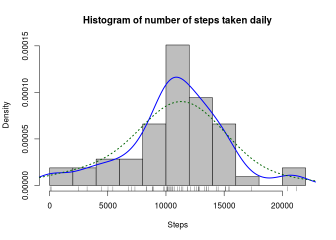
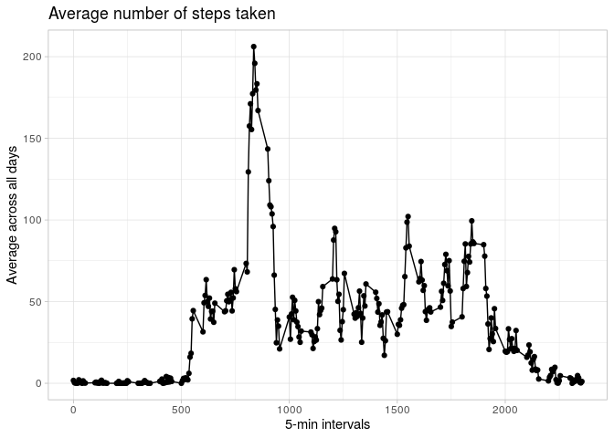
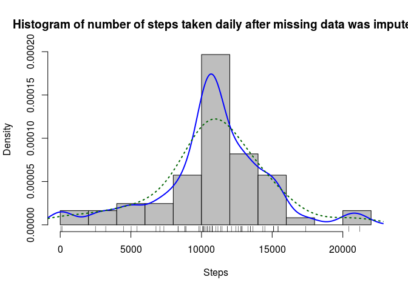
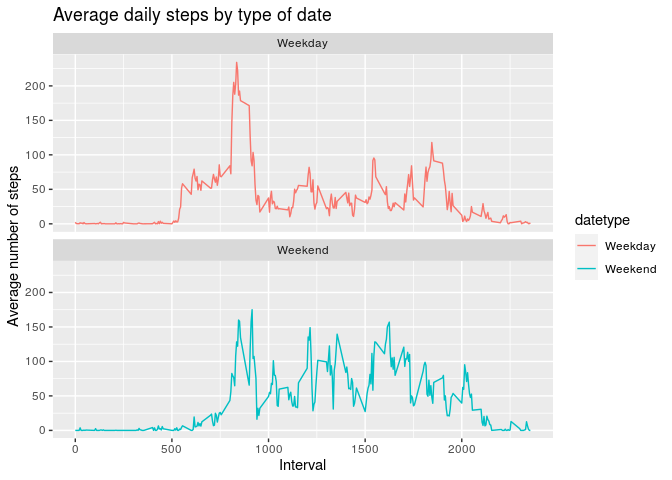

## Introduction
It is now possible to collect a large amount of data about personal movement using activity monitoring devices such as a *Fitbit*, *Nike Fuelband*, or *Jawbone Up*. These type of devices are part of the **“quantified self”** movement – a group of enthusiasts who take measurements about themselves regularly to improve their health, to find patterns in their behavior, or because they are tech geeks. But these data remain under-utilized both because the raw data are hard to obtain and there is a lack of statistical methods and software for processing and interpreting the data.

This report makes use of data from a personal activity monitoring device. This device collects data at *5 minute intervals* through out the day. The data consists of *two months of data* from an anonymous individual collected during the months of October and November, 2012 and include the number of steps taken in 5 minute intervals each day.

The dataset is available at : [Activity monitoring data](https://d396qusza40orc.cloudfront.net/repdata%2Fdata%2Factivity.zip)

## Setting global options

```r
knitr::opts_chunk$set(echo = TRUE, warning = FALSE, message = FALSE)
```


```r
library(dplyr)
library(ggplot2)
library(ggpubr)
```

## Downloading the data

```r
url <- "https://d396qusza40orc.cloudfront.net/repdata%2Fdata%2Factivity.zip"
file <- "Activity.zip"
unzipped_file <- "activity.csv"
if(!file.exists(unzipped_file)){
        download.file(url, file, method = "curl")
        download_date <- date()
        unzip(file)
        file.remove(file)
} else {
        print("File already exists!")
}
```

```
## [1] "File already exists!"
```

## Reading & PreProcessing the data

```r
activity <- read.csv(unzipped_file)
summary(activity)
```

```
##      steps            date              interval     
##  Min.   :  0.00   Length:17568       Min.   :   0.0  
##  1st Qu.:  0.00   Class :character   1st Qu.: 588.8  
##  Median :  0.00   Mode  :character   Median :1177.5  
##  Mean   : 37.38                      Mean   :1177.5  
##  3rd Qu.: 12.00                      3rd Qu.:1766.2  
##  Max.   :806.00                      Max.   :2355.0  
##  NA's   :2304
```

```r
str(activity)
```

```
## 'data.frame':	17568 obs. of  3 variables:
##  $ steps   : int  NA NA NA NA NA NA NA NA NA NA ...
##  $ date    : chr  "2012-10-01" "2012-10-01" "2012-10-01" "2012-10-01" ...
##  $ interval: int  0 5 10 15 20 25 30 35 40 45 ...
```

```r
head(activity, 10)
```

```
##    steps       date interval
## 1     NA 2012-10-01        0
## 2     NA 2012-10-01        5
## 3     NA 2012-10-01       10
## 4     NA 2012-10-01       15
## 5     NA 2012-10-01       20
## 6     NA 2012-10-01       25
## 7     NA 2012-10-01       30
## 8     NA 2012-10-01       35
## 9     NA 2012-10-01       40
## 10    NA 2012-10-01       45
```

We see here, that a lot of the data for the number of steps is NA.
So we will try to view a subset of the data that is not NA.

```r
Valid <- activity[!is.na(activity$steps),]
ValidData <- tbl_df(Valid)
head(Valid, 10)
```

```
##     steps       date interval
## 289     0 2012-10-02        0
## 290     0 2012-10-02        5
## 291     0 2012-10-02       10
## 292     0 2012-10-02       15
## 293     0 2012-10-02       20
## 294     0 2012-10-02       25
## 295     0 2012-10-02       30
## 296     0 2012-10-02       35
## 297     0 2012-10-02       40
## 298     0 2012-10-02       45
```

## Histogram of the total number of steps taken each day

We see the data is fairly tidy, we can start our analysis without doing anymore pre processing. But one column we need to add is the number of steps for each day.
This number of steps is the data we will work with here.

```r
DayData <- ValidData %>%
        group_by(date) %>%
        summarise_each(funs(sum(steps))) %>%
        select(date, steps) %>%
        print
```

```
## # A tibble: 53 x 2
##    date       steps
##    <chr>      <int>
##  1 2012-10-02   126
##  2 2012-10-03 11352
##  3 2012-10-04 12116
##  4 2012-10-05 13294
##  5 2012-10-06 15420
##  6 2012-10-07 11015
##  7 2012-10-09 12811
##  8 2012-10-10  9900
##  9 2012-10-11 10304
## 10 2012-10-12 17382
## # … with 43 more rows
```

Now we will try to plot a histogram of the number of steps each day.


```r
X = DayData$steps
hist(X, probability = TRUE, breaks = 15, col="grey", main = "Histogram of number of steps taken daily", xlab = "Steps")# prob=TRUE for probabilities not counts
rug(X)
lines(density(X), col="blue", lwd=2) # add a density estimate with defaults
lines(density(X, adjust=2), lty="dotted", col="darkgreen", lwd=2)
```

<!-- -->

## Mean and median number of steps taken each day


```r
(summary(DayData$steps))
```

```
##    Min. 1st Qu.  Median    Mean 3rd Qu.    Max. 
##      41    8841   10765   10766   13294   21194
```

```r
Mean <- summary(DayData$steps)['Mean']
Median <- summary(DayData$steps)['Median']
```

## Time series plot of the average number of steps taken
To find the average number of steps for every interval, we will summarise the data grouped by intervals and then find their individual group means.


```r
IntervalData <- ValidData %>%
        group_by(interval) %>%
        summarise_each(funs(mean(steps))) %>%
        select(interval, steps) %>%
        print
```

```
## # A tibble: 288 x 2
##    interval  steps
##       <int>  <dbl>
##  1        0 1.72  
##  2        5 0.340 
##  3       10 0.132 
##  4       15 0.151 
##  5       20 0.0755
##  6       25 2.09  
##  7       30 0.528 
##  8       35 0.868 
##  9       40 0     
## 10       45 1.47  
## # … with 278 more rows
```

The plot is : 


```r
g <- ggplot(data = IntervalData, aes(x = interval, y = steps)) + 
        geom_point() +
        geom_line()+
        labs(title = "Average number of steps taken") + labs(x = "5-min intervals", y = "Average across all days") +
        theme_light()
print(g)
```

<!-- -->

## The 5-minute interval that, on average, contains the maximum number of steps


```r
M <- (which.max(IntervalData$steps))
print(IntervalData[M,1:2])
```

```
## # A tibble: 1 x 2
##   interval steps
##      <int> <dbl>
## 1      835  206.
```

## Code to describe and show a strategy for imputing missing data


The number of NAs in our actual data is 2304. Total number of rows in out dataset is 17568. So the percent of missing data is 13.1147541.  
It's probably not a good idea to just leave out such a major chunk of our data.
So we will try to fill in the missing data.
Some of the viable strategies could be to use the mean/median for that day, or the mean for that 5-minute interval,etc.
In our analysis we will use the mean for the interval we are looking to impute.


```r
#The funtions loops through all the rows in a table, checking the steps column for NA values. If a specific row is NA then the function imputes the data for that interval from the IntervalData table which contains the means for all the intervals.
ImputeData <- function(activity){
        for(i in 1:nrow(activity)){
                if(is.na(activity[i,]['steps'])){
                        activity[i,]['steps'] <- IntervalData[i%%288,]['steps']
                        if ((i %% 288) == 0){
                                activity[i,]['steps'] <- IntervalData[288,]['steps']
                        }
                }
        }
        invisible(activity)
}

new_activity <- activity
before <- sum(is.na(new_activity))
NotValid <- is.na(activity$steps)
new_activity <- ImputeData(new_activity)
after <- sum(is.na(new_activity))
```

NAs before imputing data : 2304
NAs after imputing data : 0

## Histogram of the total number of steps taken each day after missing values are imputed


```r
NewActivityData <- tbl_df(new_activity)

DayDataNew <- NewActivityData %>%
        group_by(date) %>%
        summarise_each(funs(sum(steps))) %>%
        select(date, steps) %>%
        print
```

```
## # A tibble: 61 x 2
##    date        steps
##    <chr>       <dbl>
##  1 2012-10-01 10766.
##  2 2012-10-02   126 
##  3 2012-10-03 11352 
##  4 2012-10-04 12116 
##  5 2012-10-05 13294 
##  6 2012-10-06 15420 
##  7 2012-10-07 11015 
##  8 2012-10-08 10766.
##  9 2012-10-09 12811 
## 10 2012-10-10  9900 
## # … with 51 more rows
```


```r
X = DayDataNew$steps
hist(X, probability = TRUE, breaks = 15, col="grey", main = "Histogram of number of steps taken daily after missing data was imputed", xlab = "Steps")# prob=TRUE for probabilities not counts
rug(X)
lines(density(X), col="blue", lwd=2) # add a density estimate with defaults
lines(density(X, adjust=2), lty="dotted", col="darkgreen", lwd=2)
```

<!-- -->


## Panel plot comparing the average number of steps taken per 5-minute interval across weekdays and weekends


```r
new_activity <- read.csv("activity.csv")
new_activity$date <- as.POSIXct(new_activity$date, "%Y-%m-%d")
weekday <- weekdays(new_activity$date)
new_activity <- cbind(new_activity,weekday)
summary(new_activity)
```

```
##      steps             date               interval        weekday         
##  Min.   :  0.00   Min.   :2012-10-01   Min.   :   0.0   Length:17568      
##  1st Qu.:  0.00   1st Qu.:2012-10-16   1st Qu.: 588.8   Class :character  
##  Median :  0.00   Median :2012-10-31   Median :1177.5   Mode  :character  
##  Mean   : 37.38   Mean   :2012-10-31   Mean   :1177.5                     
##  3rd Qu.: 12.00   3rd Qu.:2012-11-15   3rd Qu.:1766.2                     
##  Max.   :806.00   Max.   :2012-11-30   Max.   :2355.0                     
##  NA's   :2304
```

```r
new_activity$date <- as.Date(strptime(new_activity$date, format="%Y-%m-%d"))
new_activity$datetype <- sapply(new_activity$date, function(x) {
        if (weekdays(x) == "Saturday" | weekdays(x) =="Sunday") 
        {y <- "Weekend"} else 
        {y <- "Weekday"}
        y
})

activity_by_date <- aggregate(steps~interval + datetype, new_activity, mean, na.rm = TRUE)
plot<- ggplot(activity_by_date, aes(x = interval , y = steps, color = datetype)) +
        geom_line() +
        labs(title = "Average daily steps by type of date", x = "Interval", y = "Average number of steps") +
        facet_wrap(~datetype, ncol = 1, nrow=2)
print(plot)
```

<!-- -->
